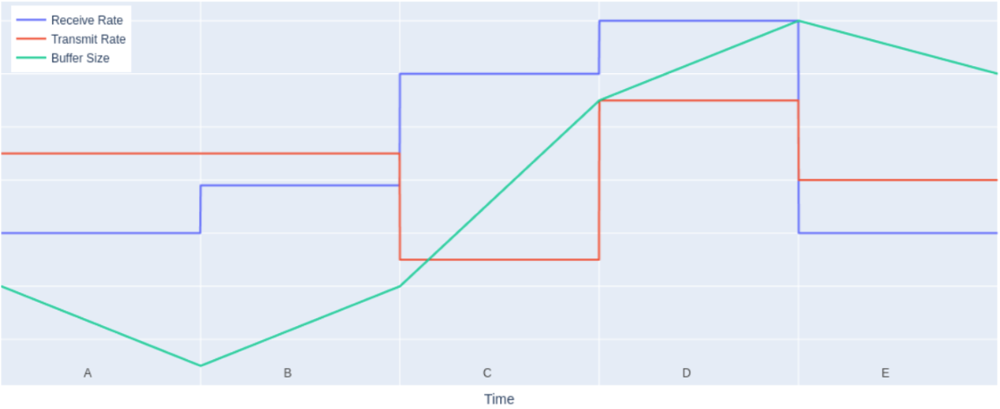

#### 1. Please create a pie chart that shows a breakdown of how you would prefer to spend your time during an average working day.

#### 2. Please find a URL that will return a JSON collection of all of Tesla’s Superchargers, stores, service centers, body shops, destination chargers, and demo drive locations.

#### 3. A charger monitoring system receives data from a charger, stores it in a buffer, then transmits it to the cloud. The following plot shows the diagnostic telemetry. The receive rate and transmit rate are correct, but the buffer size telemetry is incorrect. Which is the first time interval that shows the error?

#### 4. Please implement the following function
def num_charging_stops(legs: List[int], capacity: int) -> int:
  """Calculates the number of necessary charging stops to reach the destination.

  Each "leg" of your journey represents the amount of energy required to drive
  that leg of the trip. For example, if a leg has a value of 5 and your
  battery's energy level before driving the leg is 12, then driving that leg
  will drop the battery's energy level to 7 (12-5). After driving each leg, you
  have the choice of whether to charge or not. If you decide to charge, your
  battery's energy level get's returned to "capacity". If you decide not to
  charge, your battery's energy level is unchanged. The goal is to calculate
  the minimum number of charging stops needed to reach the destination without
  ever letting your battery's level fall below 0. If it isn't possible to reach
  the destination with the given inputs, -1 should be returned.

  Assume that your battery is charged to full capacity to start.

  Examples:
    num_charging_stops([25], 30) -> 0
    num_charging_stops([25, 25], 30) -> 1
    num_charging_stops([50], 30) -> -1
    num_charging_stops([15, 15, 30]) -> 1
    num_charging_stops([15, 30, 15]) -> 2
  """

#### 5. Please implement the following function
def fill_tank(tank_size: int, bucket_sizes: List[int]) -> List[int]:
 """Returns the bucket scoops needed to fill a tank of a given size.

 You're trying to fill a tank exactly full of water by scooping water from an
 infinite reservoir using a set of buckets. The goal is to find the bucket
 scoops that exactly fill the tank while minimizing the number of scoops
 needed.

 Examples:
   fill_tank(20, [6, 4, 3, 2]) => [6, 6, 4 ,4]
   fill_tank(6, [5, 4, 2]) => [4, 2]
   fill_tank(3, [2]) => None
 """

